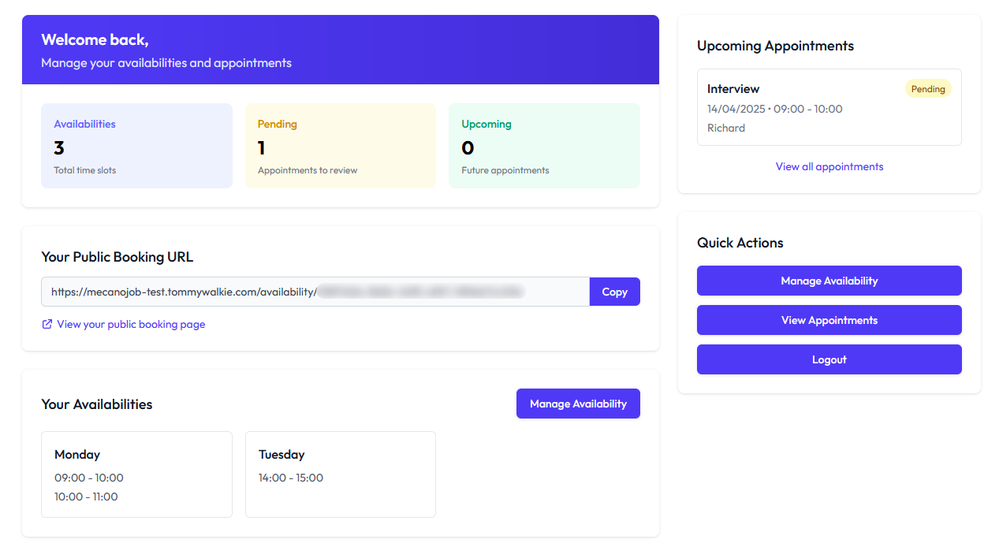

# MecanoJob Test

Appointment scheduling system, intended for a technical test for MecanoJob.

The project is currently hosted on my personal website: https://mecanojob-test.tommywalkie.com.

A Swagger UI is available at `/docs`.



## Project structure

The project is a PNPM-based monorepo with a client and a server.

### Tech choices

#### Client

- **Vite**: This is my main tool for building (headless) frontend applications.
- **React**: This is my preferred frontend framework, and this is the one that the company I'm enrolling in is using.
- **TailwindCSS**: I could have chosen any other CSS framework, or CSS-in-JS library, but I'm very comfortable with TailwindCSS.
- **Zod**: This is my preferred schema declaration and validation library and for quick type inference.
- **React Hook Form**: This is what I like to use for interactive and predictable forms.
- **Tanstack Query**: This is my go-to library for data fetching, caching and state management.

#### Server

- **NestJS**: This is a popular Node.js framework for building scalable server-side applications.
  - Following my previous experience with it, I know it well and it's a good fit for this project and the entities I had in mind.
  - My intent is to let:
    - the **controllers** handle the routing and Swagger documentation,
    - the **services** handle the business logic,
    - there could have been **repositories** to handle the database queries, but the TypeORM integration with NestJS already handles this.
- **TypeORM**: I needed a simple database for the technical test and I know TypeORM is well integrated with NestJS, so I picked it with the `better-sqlite3` driver, even though I could have used a more robust database like PostgreSQL.
- **Swagger**: While I'm implementing the project and considering adding (or not) some JSDoc to the codebase, I can simply use Swagger to document the API and test it.

#### Tooling

- **PNPM**: This is my preferred package manager, and it's capable of handling the monorepo structure I'm using.
- **Dotenvx**: This is a cross-platform tool that allows me to manage environment variables in a single place, and it's compatible with PNPM.
- **Concurrently**: This is a tool that allows me to run multiple commands concurrently with decent terminal output.
- **Vitest**: When using Vite-based projects, I like to use Vitest for testing, as it's more performant than Jest, and can work with Node projects too when well configured.

## Prerequisites

- Node.js (v18+)
- pnpm (v10+)

### Environment variables

The project uses environment variables for the client and the server, using both a `.env` file for development and a `.env.production` file for production, which are served by the `dotenvx` package.

```php
# Client environment variables
VITE_API_URL="" # URL of the server

# Server environment variables
DB_FILE="" # Path to the SQLite database file (default: my.db)
JWT_SECRET="" # Secret key for the JWT token (default: secret)
```

## Installation

```bash
pnpm install
```

**Note**: The project is designed with PNPM v10+ in mind, which notably allows for the use of the `onlyBuiltDependencies` option in our `package.json`. So if you encounter issues when running the server, typically if binaries are not found for `better-sqlite3` and `bcrypt`, you may need to upgrade your PNPM version, prune the PNPM cache and reinstall the dependencies.

## Development

This command will simultaneously run the client and the server in development mode using environment variables from the `.env` file.

```bash
pnpm dev
```

## Testing

This command will simultaneously run the tests for the client and the server using environment variables from the `.env` file.

```bash
pnpm test
```

## Build

This command will simultaneously build the client and the server in production mode using environment variables from the `.env.production` file.

Frontend build output will be to the `public` folder of the server.

```bash
pnpm build
```

You can run the production build by running the `start` script.

```bash
pnpm start
```

## Formatting

This command will format the client and the server using Prettier.

```bash
pnpm format
```

## License

This project is licensed under the GPL-3.0 license. See the [LICENSE](LICENSE) file for details.
